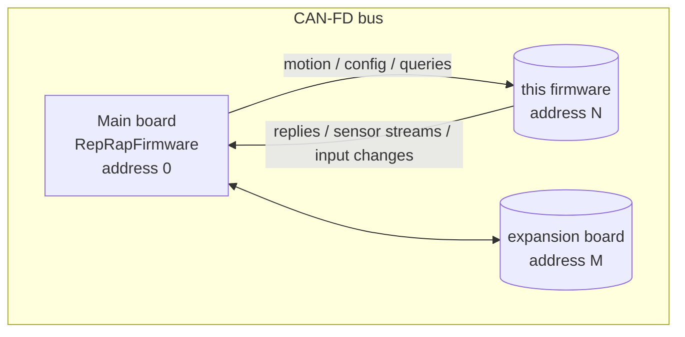
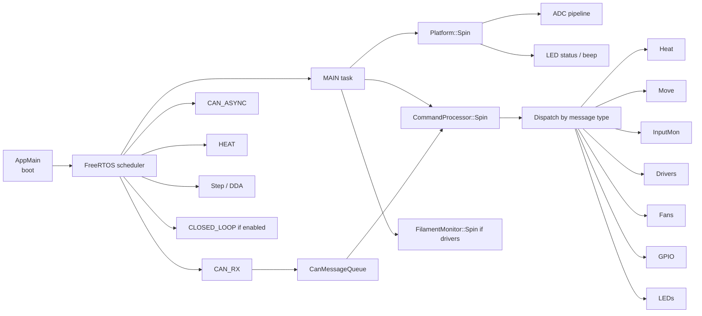
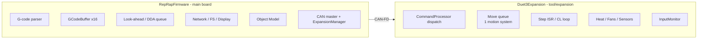
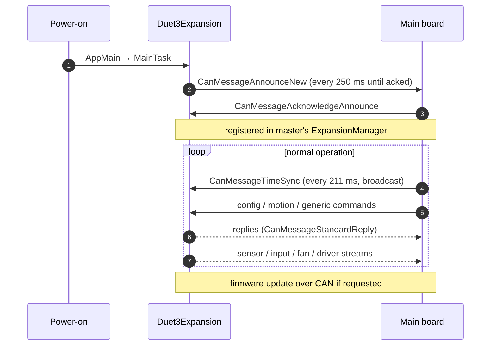
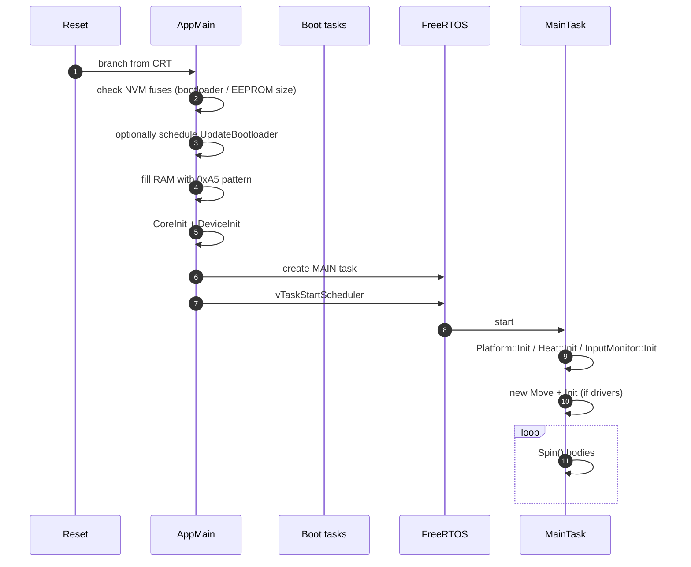

# Duet3Expansion Architecture

This document is the entry point for the Duet3Expansion source. Everything else in this folder dives deeper into one subsystem.

## 1. Role on the bus

Duet3Expansion runs on tool / expansion boards behind a Duet 3 main board. From the bus's point of view, every Duet3Expansion board is **one CAN address**: it receives commands from address 0 (the main board) and replies / streams data back. It never initiates traffic to other expansion boards.



What this firmware does **not** have:

- A G-code parser. Codes never reach an expansion board as text.
- A networking stack, file system, or printable display.
- A main-board "RepRap" container — there is no `reprap` global. Modules are namespaces or singletons.
- Most of the `M`/`G`/`T` dispatch logic. Configuration arrives as pre-parsed `CanMessageGeneric` packets.

What it shares with RepRapFirmware:

- The same CANlib message structs (this is the contract that holds the bus together).
- The same step-clock rate (750 kHz on Duet 3) and the same shaped-motion math, so a move can be split between local and remote drives without seams.
- The same TMC smart-driver code (`Movement/StepperDrivers/`).
- The same heating, fan, and sensor abstractions (much-reduced versions).

## 2. Boards and processors

Duet3Expansion targets a wide range of boards. Each falls into one of two broad classes:

| Class | Examples | Processor | Drivers per board |
|---|---|---|---|
| **Tool boards** | TOOL1LC, TOOL1RR | SAMC21 / RP2040 | 1 (driving extruder/Z, also reading sensors close to the hotend) |
| **Expansion boards** | EXP3HC, M23CL | SAME5x | 3 (general-purpose CAN-attached driver banks) |

A few feature flags in [src/Config/BoardDef.h](../../src/Config/BoardDef.h) capture the major variations:

| Flag | Meaning |
|---|---|
| `SUPPORT_DRIVERS` | Has stepper drivers (most boards). |
| `SINGLE_DRIVER` | Exactly one driver — enables single-driver code paths for closed-loop. |
| `SUPPORT_THERMISTORS` / `HAS_VOLTAGE_MONITOR` / `HAS_VREF_MONITOR` | Hardware-specific. |
| `SUPPORT_LIS3DH` | Onboard accelerometer. |
| `SUPPORT_LDC1612` | Inductive scanning sensor (Z-probe). |
| `SUPPORT_AS5601` | Magnetic filament monitor. |
| `SUPPORT_CLOSED_LOOP` | Closed-loop driver mode (1HCL / 3HC). |
| `USE_SERIAL_DEBUG` | Use UART for diagnostic prints; otherwise debug printf goes over CAN. |

## 3. Top-level structure



There is no global `reprap` object. The closest equivalents are:

- **`Move *moveInstance`** in [src/RepRapFirmware.cpp](../../src/RepRapFirmware.cpp).
- **`ClosedLoop *closedLoopInstance`** if `SUPPORT_CLOSED_LOOP`.
- The other modules (`Heat`, `FansManager`, `Platform`, `InputMonitor`, `FilamentMonitor`, `LedStripManager`, `CommandProcessor`) are namespaces or singletons.

## 4. The MAIN task

[src/Platform/Tasks.cpp:329](../../src/Platform/Tasks.cpp) — `MainTask`:

```cpp
extern "C" [[noreturn]] void MainTask(void *) noexcept
{
    Platform::Init();
    Heat::Init();
    InputMonitor::Init();
#if SUPPORT_DRIVERS
    moveInstance = new Move();
    moveInstance->Init();
#endif
    SetSpinLockChecksEnabled(true);
    for (;;)
    {
        EnterSpin(Module::Platform);   Platform::Spin();
        EnterSpin(Module::CAN);        CommandProcessor::Spin();
#if SUPPORT_DRIVERS
        EnterSpin(Module::FilamentSensors); FilamentMonitor::Spin();
#endif
    }
}
```

This is the cooperative loop, the same idea as RRF's `RepRap::Spin()` but with a much shorter list. Heat runs on its own task so it never starves; CAN reception runs on its own task so it never drops frames; motion is interrupt-driven.

## 5. Comparison to RepRapFirmware



Roughly: RRF is a printer controller that *can* talk to expansion boards. Duet3Expansion is a CAN-attached I/O module that reuses RRF's drivers and motion math.

## 6. Interaction with the master

The dataflow with the main board is simple in shape but rich in detail:



For the wire-level details of every message see [CAN_PROTOCOL.md](CAN_PROTOCOL.md).

## 7. Module map

| Module | Path | Purpose |
|---|---|---|
| `Platform` | [src/Platform/Platform.cpp](../../src/Platform/Platform.cpp) | Hardware setup, ADC averaging, voltage / MCU temp, status LEDs, beeper. |
| `CommandProcessor` | [src/CommandProcessing/CommandProcessor.cpp](../../src/CommandProcessing/CommandProcessor.cpp) | Receive a CAN frame, decode, dispatch. The biggest file in the firmware. |
| `CanInterface` | [src/CAN/CanInterface.cpp](../../src/CAN/CanInterface.cpp) | CAN HAL wrapper, RX/TX queues, time sync, announce. |
| `Move` | [src/Movement/Move.cpp](../../src/Movement/Move.cpp) | Local motion: receive shaped moves, schedule against master clock, run step ISR. |
| `Heat` | [src/Heating/Heat.cpp](../../src/Heating/Heat.cpp) | Local heaters and sensors. |
| `FansManager` | [src/Fans/](../../src/Fans) | Local fans (PWM, thermostatic, tacho). |
| `InputMonitor` | [src/InputMonitors/InputMonitor.cpp](../../src/InputMonitors/InputMonitor.cpp) | Remote handles for endstops / GP-in / probes. |
| `FilamentMonitor` | [src/FilamentMonitors/](../../src/FilamentMonitors) | Filament motion / pulse / magnetic monitors. |
| `LedStripManager` | [src/LedStrips/](../../src/LedStrips) | DotStar / NeoPixel patterns. |
| `GPIO` | [src/GPIO/](../../src/GPIO) | GP-out PWM, servo. |
| `ClosedLoop` | [src/ClosedLoop/](../../src/ClosedLoop) | Optional, single-driver only. |
| `AccelerometerHandler` / `MFMHandler` / `ScanningSensorHandler` | [src/CommandProcessing/](../../src/CommandProcessing) | Onboard sensor coordinators that stream samples back to the master. |

## 8. The four big data structures

| Structure | Lives in | Holds |
|---|---|---|
| `MoveSegment` chain (per drive, per move) | `Move` | Pending step plan for the next move(s). |
| `RemoteInputHandle` table | `InputMonitor` | Master-allocated handles for inputs the master is observing. |
| `Heater` array | `Heat` | One per local heater; runs PID, reports back. |
| `CanMessageBuffer` pool | `CanInterface` | Shared between RX and TX. Pool exhaustion is a hard failure mode. |

## 9. Boot sequence



The UpdateBootloader path is unusual: when the master sends `M997 B<addr>`, the bootloader is rewritten by booting a stripped-down task that does nothing else. This is necessary on small chips where an in-place bootloader update would not fit alongside the main firmware.

## 10. Closed-loop variant

On 1HCL boards (single closed-loop driver) the architecture changes slightly: instead of an open-loop step ISR, a high-priority current loop runs in a dedicated `CLOSED_LOOP` task at typically 50 kHz, fed by the `MoveSegment` chain. See [CLOSED_LOOP.md](CLOSED_LOOP.md).

## 11. Where this connects to the rest of the system

- The CAN-FD message types it receives are exactly those sent by [`CanInterface`](https://github.com/Duet3D/RepRapFirmware/blob/3.7-docker/src/CAN/CanInterface.cpp) and [`CanMotion`](https://github.com/Duet3D/RepRapFirmware/blob/3.7-docker/src/CAN/CanMotion.cpp) on the main board.
- Object Model entries for boards living on the bus are populated by RRF's `ExpansionManager` from data this firmware streams back. This board has *no* Object Model of its own.
- See [RepRapFirmware's CAN_BUS.md](https://github.com/Duet3D/RepRapFirmware/blob/3.7-docker/docs/devel/CAN_BUS.md) for the matching master-side picture.
