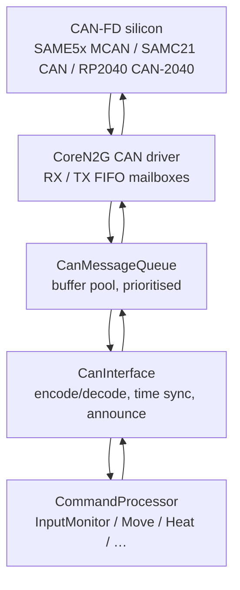
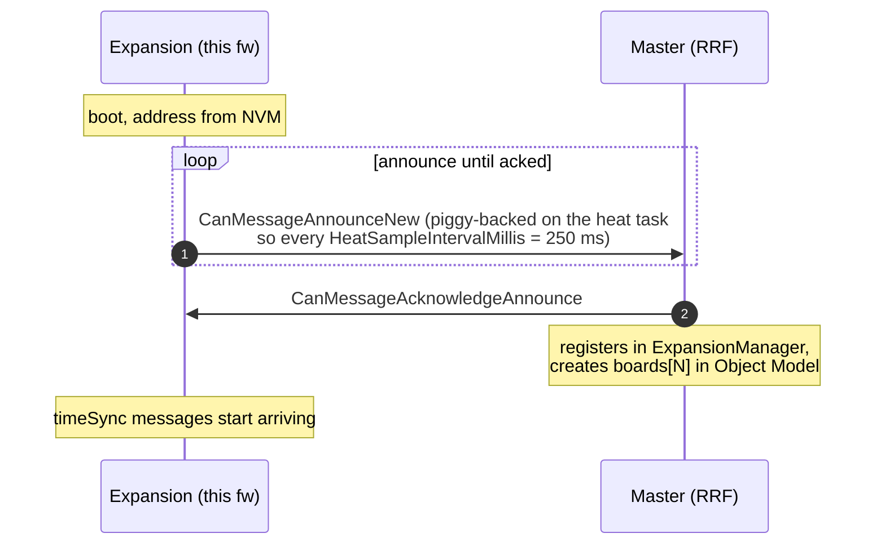
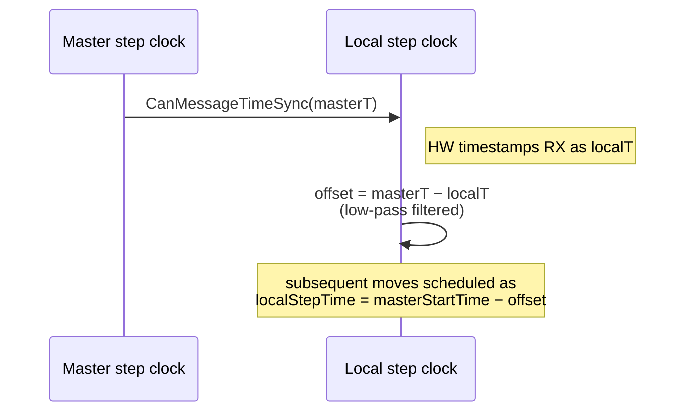
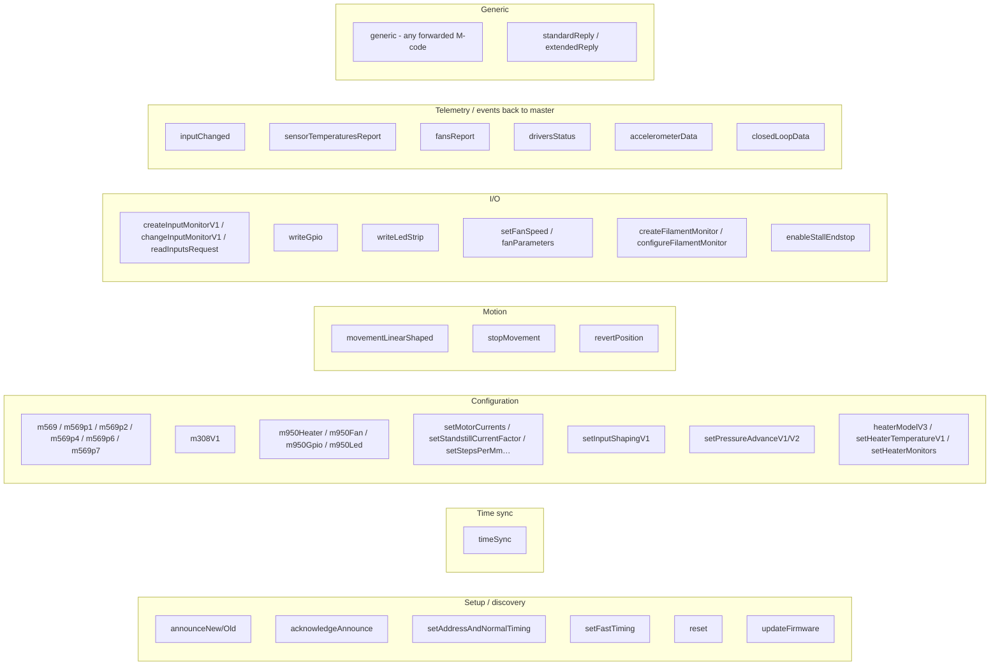
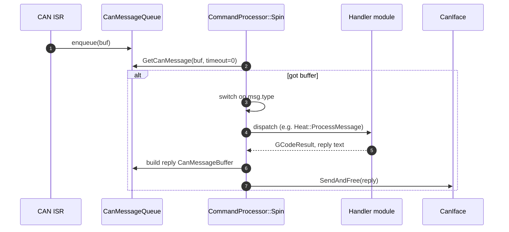
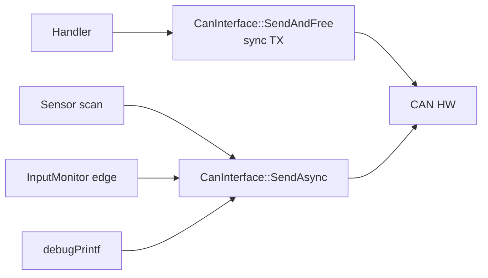
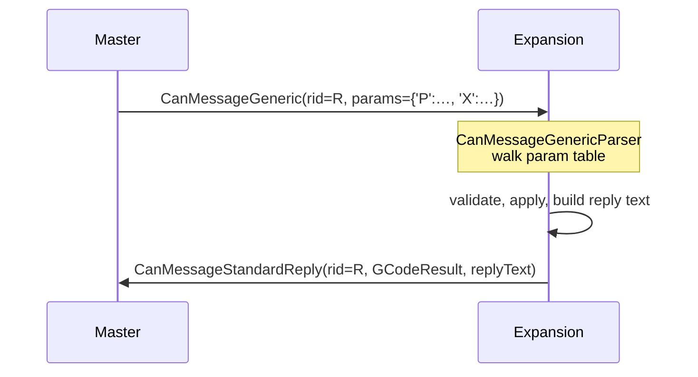
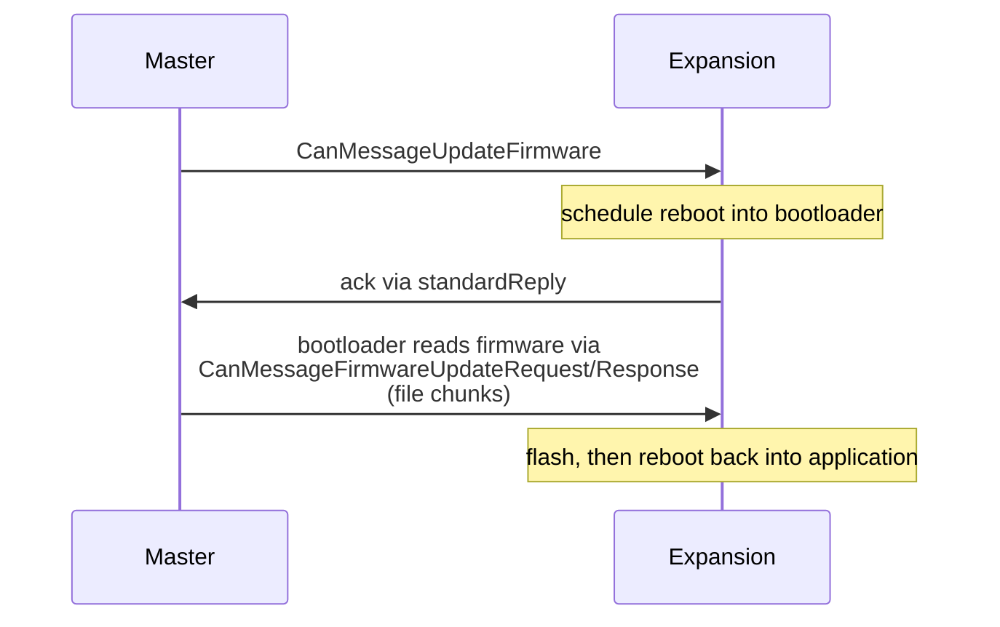

# CAN-FD Protocol (slave perspective)

Everything on the bus revolves around the protocol defined in the **CANlib** submodule, shared verbatim between RepRapFirmware (master) and this firmware. This document describes the bus from this firmware's point of view; the matching master-side document is [RepRapFirmware/docs/devel/CAN_BUS.md](../../../RepRapFirmware/docs/devel/CAN_BUS.md).

## 1. The layers

| Layer | Files |
|---|---|
| Silicon / driver | provided by `CoreN2G` submodule |
| Buffer pool | [CAN/CanMessageQueue.cpp](../../src/CAN/CanMessageQueue.cpp), [CANlib/CanMessageBuffer.cpp] |
| Interface | [CAN/CanInterface.cpp](../../src/CAN/CanInterface.cpp) |
| Application | [CommandProcessing/CommandProcessor.cpp](../../src/CommandProcessing/CommandProcessor.cpp) and consumers |

## 2. Address negotiation

A board boots with the address persisted in NVM (`Platform::nvData.canAddress`). If the user has not yet assigned one with `M952`, this is a *default* address from `CanId::DefaultAddress`.

`M952 P<old> A<new>` causes the master to send `CanMessageSetAddressAndNormalTiming` to the board at `<old>`, which rewrites NVM, briefly resets, and re-announces under `<new>`.

`CanMessageAnnounceNew` is the modern variant; `CanMessageAnnounceOld` is kept for backwards compatibility and reports board type / version / unique ID / firmware version.

## 3. Time synchronisation

The master broadcasts `CanMessageTimeSync` every `CanClockIntervalMillis = 211` ms (a deliberately-chosen prime to avoid beating against other periodic activity). It carries the master's current step-clock value (`uint32_t`, 750 kHz on Duet 3).

Because both clocks tick at exactly 750 kHz and CAN-FD round-trip is sub-millisecond, the residual error is small enough that an extruder driver and an X driver on different boards stay step-aligned for arbitrarily long moves. See [`CanInterface::CheckBrs`](../../src/CAN/CanInterface.cpp) for the BRS (Bit Rate Switch) sanity check applied before accepting a sync.

## 4. Message families

CAN-FD frames carry up to 64 bytes; longer payloads are split using sequence numbers (`CanMessageBuffer::fragmentNumber`). The complete enum lives in `CANlib/src/CanMessageFormats.h`. Grouped by purpose:

## 5. The receive path

CAN frames arrive via interrupt and are placed by the silicon driver into a software queue ([`CanMessageQueue`](../../src/CAN/CanMessageQueue.cpp)). The MAIN task pulls them out inside `CommandProcessor::Spin`:

The dispatch table is large — see [COMMAND_PROCESSING.md](COMMAND_PROCESSING.md).

## 6. The transmit path

Outgoing traffic falls into two categories with different latency requirements:

- **Synchronous reply** — produced inline in `CommandProcessor::Spin` after handling a request. Sent via `CanInterface::SendAndFree`. The master is blocking on this reply via its `SendRequestAndGetStandardReply` helper.
- **Asynchronous push** — temperature reports, input-changed events, fan reports, driver status, accelerometer / closed-loop sample bursts, debug printf. Queued onto a separate async sender driven by a dedicated FreeRTOS task to avoid stalling the MAIN task.

`debugPrintf` writes its bytes through `CanInterface::DebugPutc` so that `M122 B<addr>` style diagnostics propagate back to the master without needing a serial port.

## 7. Generic forwarded commands

Most user-facing M-codes that touch a remote board are sent as `CanMessageGeneric` — a parameter table (letter, type, value) plus a request id. The handler on this side parses it with `CanMessageGenericParser` against the same parameter table the master used to build it. The parser is generated from a shared description so master and slave stay in sync.

The request id (`rid`) is the master's correlation token — copying it back in the reply is what lets `CanInterface::SendRequestAndGetStandardReply` pair request and reply across concurrent traffic.

## 8. Streaming / event messages

Information the master needs continuously is pushed without being asked:

| Source | Message | Cadence |
|---|---|---|
| Temperature sensors | `sensorTemperaturesReport` | grouped, every `HeatSampleIntervalMillis = 250` ms (~4 Hz) |
| Fan tachometers | `fansReport` | piggy-backed on the heat-task tick (~4 Hz) |
| InputMonitor edges | `inputChanged` | on edge or watchdog interval |
| Smart driver status | `driversStatus` | on event |
| Accelerometer (M956) | `accelerometerData` | high-rate burst |
| Closed-loop data (M569.4) | `closedLoopData` | high-rate burst |

Burst messages (accelerometer / closed-loop) deliberately consume bus bandwidth — they should only be enabled when actively requested by the master.

## 9. Errors and limits

- **Buffer pool exhaustion** — `CanMessageBuffer::Allocate()` returns null. The firmware logs and, depending on path, may drop the lowest-priority pending TX. Persistent exhaustion is reported in M122.
- **Time-sync loss** — if no `timeSync` arrives within a few hundred ms, the firmware refuses new motion and signals "no master clock" through `inputChanged` heartbeat.
- **Master timeout** — if the master does not see a board status report for `StatusMessageTimeoutMillis = 5000` ms ([ExpansionManager.h](../../../RepRapFirmware/src/CAN/ExpansionManager.h)) it marks the board `timedOut` in its Object Model. The user sees the board disappear from `boards[]`.
- **Fragment loss** — fragments use sequence numbers; an out-of-order fragment causes the whole multi-frame message to be dropped. Resending is up to the master.

## 10. Firmware update over CAN

For the SAME5x / SAMC21 boards a separate small bootloader (16 KB / 64 KB) is what handles flashing. RP2040 boards use UF2 and have a different entry sequence (see `RequestFirmwareBlock` in [Tasks.cpp](../../src/Platform/Tasks.cpp)).

## 11. Where this connects to the rest of the system

- The matching master-side documentation is at [RepRapFirmware/docs/devel/CAN_BUS.md](../../../RepRapFirmware/docs/devel/CAN_BUS.md).
- The CANlib submodule is the single source of truth for message struct layouts. Bumping a struct without rebuilding both firmwares is a bus-wide failure.
- For per-message-type handler details see [COMMAND_PROCESSING.md](COMMAND_PROCESSING.md).
