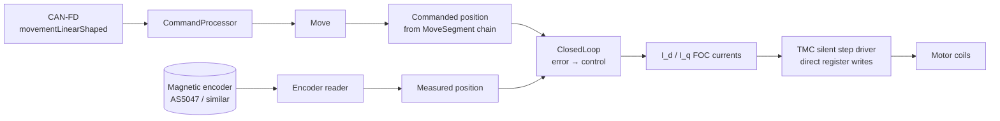
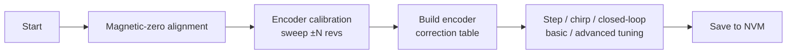

# Closed-Loop Drivers

This document describes the closed-loop control variant available on single-driver boards (typically the **1HCL** tool board). The open-loop step ISR is replaced by a current-mode loop that tracks the *commanded* motor position derived from the same `MoveSegment` chain delivered over CAN.

Closed-loop builds are gated by the `SUPPORT_CLOSED_LOOP` feature flag in [`BoardDef.h`](../../src/Config/BoardDef.h) and require `SINGLE_DRIVER`.

## 1. Pieces involved



| Component | Path |
|---|---|
| Top-level | [src/ClosedLoop/ClosedLoop.cpp](../../src/ClosedLoop/ClosedLoop.cpp) |
| Tuning / calibration | [src/ClosedLoop/Tuning.cpp](../../src/ClosedLoop/Tuning.cpp) |
| Encoder hardware | [src/ClosedLoop/Encoders/](../../src/ClosedLoop/Encoders) |
| Sample buffer (telemetry) | [src/ClosedLoop/SampleBuffer.cpp](../../src/ClosedLoop/SampleBuffer.cpp) |

## 2. Control loop

```mermaid
flowchart LR
    R[Reference<br/>commanded θ] --> Sub((-))
    Y[Measured θ] --> Sub
    Sub --> PID[PID]
    PID --> CL2[Coil current<br/>I_d, I_q]
    CL2 --> Trans[Park/Clarke inverse]
    Trans --> ABC[A/B current refs]
    ABC --> TMC[TMC chopper drives PWM]
    TMC --> Motor[Motor]
    Motor --> Enc[Encoder]
    Enc --> Y
```

The reference position is **not** the master's commanded shaft position directly — it is the result of integrating velocity from the segment chain at the closed-loop sample rate (typically 10–50 kHz). This way, the loop bandwidth is set by the closed-loop sample rate, not by CAN traffic.

## 3. Configuration codes

| `CanMessageType` | Effect |
|---|---|
| `m569` (with `D4`) | Switch driver into closed-loop mode. |
| `m569p1` | PID gains, sample rate, encoder type, encoder steps/rev. |
| `m569p4` | Torque mode (`M569.4`) — drive constant current rather than tracking position. |
| `m569p5` | Manual move (used during tuning). |
| `m569p6` | Run a tuning sequence (encoder calibration, basic / advanced PID tuning). |
| `m569p7` | Persist calibration results. |
| `startClosedLoopDataCollection` | Begin a sample-burst collection for diagnostic graphs. |

## 4. Tuning

Tuning runs as a sequence of small motions while the encoder records the actual movement. The phases are encoded in [`Tuning.cpp`](../../src/ClosedLoop/Tuning.cpp):



Tuning errors are reported via `TuningErrors.h` codes back to the master.

## 5. Telemetry

`SampleBuffer` collects time-aligned samples (commanded θ, measured θ, error, I_d, I_q, microstep PWM) at the loop rate. When the master starts a collection (`M569.5` / `M569.6` / `startClosedLoopDataCollection`), samples are streamed back as `closedLoopData` CAN messages and DSF / DWC turns them into the closed-loop diagnostic graphs.

## 6. Where this connects to the rest of the system

- From the user's perspective closed-loop is enabled with `M569 P… D4` — a normal G-code on the master that the master forwards via [`m569`](COMMAND_PROCESSING.md#configuration--drivers).
- All motion still arrives as standard `movementLinearShaped` messages — the upstream pipeline doesn't know whether the destination driver is open- or closed-loop.
- Closed-loop diagnostic graphs are rendered by Duet Web Control from data this firmware streams. See [DuetSoftwareFramework's OBJECT_MODEL](https://github.com/Duet3D/DuetSoftwareFramework/tree/v3.7-andy/src/DuetAPI/ObjectModel/Move) for the schema fields that surface closed-loop status.
