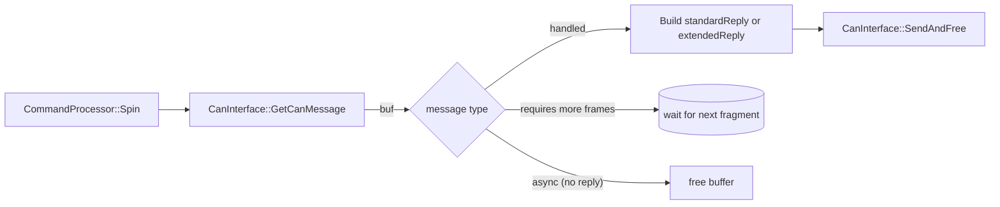

# Command Processing

This document is the reference for [`CommandProcessor::Spin`](../../src/CommandProcessing/CommandProcessor.cpp) — the dispatch table that turns received CAN messages into actions.

## 1. Loop shape



The loop is non-blocking: if no message is ready, `Spin` returns immediately and the MAIN task moves on to other work.

## 2. Dispatch table

`CommandProcessor::Spin` is essentially one large `switch` on `msg.type`. The table below summarises each branch with the module that owns the work, grouped by purpose.

### Configuration / drivers

| `CanMessageType` | Master M-code | Handler | Effect |
|---|---|---|---|
| `m569` | `M569 P… D… …` | `SmartDrivers` | Driver mode (stealthChop / spreadCycle / closedLoop) and chopper config. |
| `m569p1` | `M569.1 P…` | `ClosedLoop` | Closed-loop tuning parameters. |
| `m569p2` | `M569.2 P…` | `SmartDrivers` | Read/write a TMC register. |
| `m569p4` | `M569.4 P…` | `ClosedLoop` | Torque mode. |
| `m569p6` | `M569.6 P…` | `ClosedLoop` | Load homing config. |
| `m569p7` | `M569.7 P…` | `ClosedLoop` | Encoder calibration. |
| `setMotorCurrents` | `M906` | `SmartDrivers` | Per-driver current. |
| `setStandstillCurrentFactor` | `M917` | `SmartDrivers` | Standstill current. |
| `setStepsPerMmAndMicrostepping` | `M92`/`M350` | `Move` | Steps/mm and microsteps for local drives. |
| `setDriverStates` | `M17`/`M18` | `SmartDrivers` | Enable / disable. |
| `m915` | `M915` | `SmartDrivers` | Stall detection threshold. |
| `setPressureAdvanceV1`/`V2` | `M572` | `Move::ExtruderShaper` | Pressure advance. |
| `setInputShapingV1` | `M593` | `Move::AxisShaper` | Input shaping params. |

### Sensors / heaters / fans / GPIO / LEDs

| `CanMessageType` | Master M-code | Handler |
|---|---|---|
| `m308V1` | `M308` | `Heat` — sensor definition. |
| `m950Heater` | `M950 H…` | `Heat`. |
| `heaterModelV3` | `M307` | `Heat::Heater::SetModel`. |
| `setHeaterTemperatureV1` | `M104`/`M140` | `Heat::SetActiveTemperature`. |
| `setHeaterFaultDetection` | `M570` | `Heat`. |
| `setHeaterMonitors` | `M143` | `Heat::HeaterMonitor`. |
| `heaterFeedForwardV1` | `M309` | `Heat`. |
| `setDefaultHeaterModel` | (internal) | `Heat`. |
| `heaterTuningCommand` | `M303` | `Heat` — autotune kick-off. |
| `m950Fan` / `setFanSpeed` / `fanParameters` | `M950 F…`/`M106` | `FansManager`. |
| `m950Gpio` / `writeGpio` | `M950 P…` / `M42`/`M280` | `GpioPorts`. |
| `m950Led` / `writeLedStrip` | `M950 E…` / `M150` | `LedStripManager`. |

### Inputs (endstops / probes / GP-in)

| `CanMessageType` | Master M-code | Handler |
|---|---|---|
| `createInputMonitorV1` | (M574/M558 setup) | `InputMonitor::Create`. |
| `changeInputMonitorV1` | (state changes) | `InputMonitor::Change`. |
| `readInputsRequest` | one-shot poll | `InputMonitor::ReadHandles`. |
| `enableStallEndstop` | `M915` family | `InputMonitor` (stall path). |
| `createFilamentMonitor` / `configureFilamentMonitor` / `deleteFilamentMonitor` | `M591` | `FilamentMonitor`. |

### Motion

| `CanMessageType` | Direction | Handler |
|---|---|---|
| `movementLinearShaped` | M → E | `Move::AddRemoteMove` — schedule against master clock. |
| `stopMovement` | M → E | `Move::StopMovement` — abort queue. |
| `revertPosition` | M → E | `Move` — restore expected position after a probe trigger / abort. |

### Sensor / accelerometer / scanning

| `CanMessageType` | Handler |
|---|---|
| `accelerometerConfig` / `startAccelerometer` | `AccelerometerHandler` (LIS3DH) |
| `m655` | `ScanningSensorHandler` (LDC1612 inductive probe) |
| `startClosedLoopDataCollection` | `ClosedLoop` |

### Lifecycle / housekeeping

| `CanMessageType` | Effect |
|---|---|
| `setAddressAndNormalTiming` | Persist new CAN address, restart on bus. |
| `setFastTiming` | Switch CAN to high-speed timing. |
| `updateFirmware` | Schedule reboot into bootloader. |
| `reset` | Software reset. |
| `testReport` | Run M122 P1 self-tests, return PASS/FAIL. |
| `returnInfo` | M115 against board. |
| `m111` | Set debug flags (`M111 B<addr>`). |
| `diagnosticTest` | M122 deep dump. |

### Telemetry / events (E → M)

These are not in the dispatch table — they are produced by their owning module and pushed on the async sender:

| Producer | Message |
|---|---|
| ADC / sensor poll | `sensorTemperaturesReport` |
| Tachometer | `fansReport` |
| `InputMonitor::CheckInputs` | `inputChanged` |
| `SmartDrivers` | `driversStatus` |
| `AccelerometerHandler` | `accelerometerData` |
| `ClosedLoop` | `closedLoopData` |
| `debugPrintf` | extended message routed via `CanInterface::DebugPutc` |

## 3. Generic message parsing

For most configuration messages the payload is `CanMessageGeneric` — a key-value parameter list. Decoding uses [CanMessageGenericParser](../../src/CAN/CanInterface.cpp), driven by tables generated from a shared description so the master's encoder and the slave's decoder agree on letter / type / order.

```cpp
CanMessageGenericParser parser(msg, M308Params);
uint32_t sensorNum;
if (parser.GetUintParam('S', sensorNum)) { … }
char typeName[20];
if (parser.GetStringParam('Y', typeName, sizeof(typeName))) { … }
```

Validation errors are reported back via the standard reply with a non-OK `GCodeResult` so the master surfaces them to the user.

## 4. Reply construction

Replies live in two payload sizes:

- **`standardReply`** — short text reply that fits in one CAN-FD frame. Used for almost everything.
- **`extendedReply`** — multi-frame text response. Used for diagnostics dumps (`M122`), `returnInfo` long forms, etc.

Both carry the request id from the inbound `CanMessageGeneric` so the master can correlate.

```cpp
CanMessageStandardReply *resp = buf->SetupResponseMessage<…>(rid, srcAddress, dstAddress);
resp->resultCode = (uint16_t)result;
resp->extra = extra;
SafeStrncpy(resp->text, replyBuffer.c_str(), sizeof(resp->text));
buf->dataLength = resp->GetActualDataLength();
CanInterface::SendAndFree(buf);
```

## 5. Custom command handlers

For board-specific test code there is a [`CustomCommandHandler`](../../src/CommandProcessing/CustomCommandHandler.cpp) hook that any branch can call into before the standard table — useful for ATE / factory testing.

## 6. Where this connects to the rest of the system

- The set of messages handled here mirrors [RRF's `CanInterface`](https://github.com/Duet3D/RepRapFirmware/blob/3.7-docker/src/CAN/CanInterface.cpp) sender side: every `Send*` over there has a `case` here.
- Movement messages flow into [Move](MOTION.md).
- Input messages flow into [InputMonitor](INPUT_MONITORS.md).
- See [CAN_PROTOCOL.md](CAN_PROTOCOL.md) for the bus-level framing.
