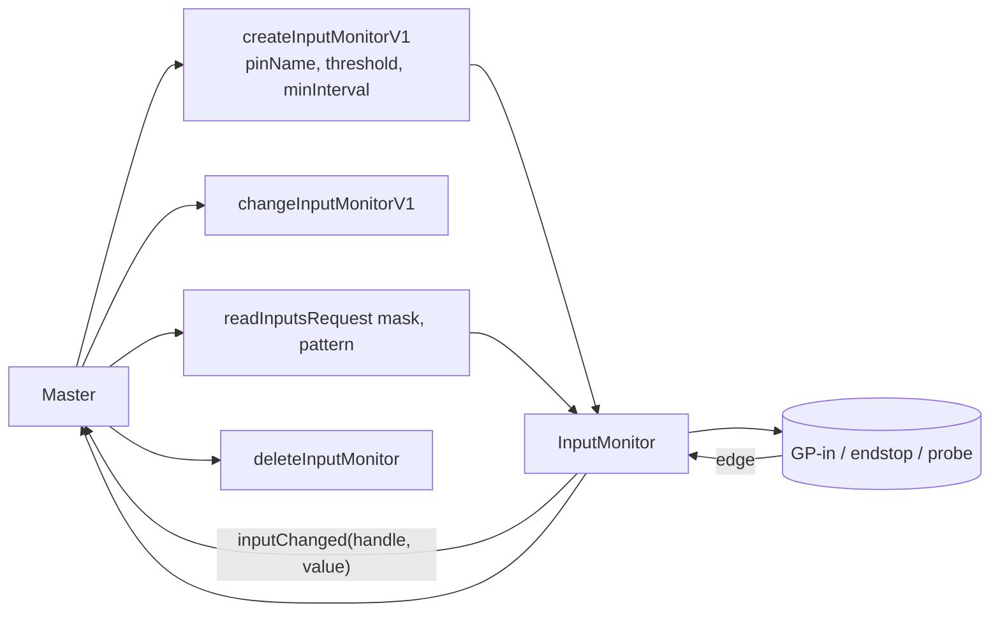
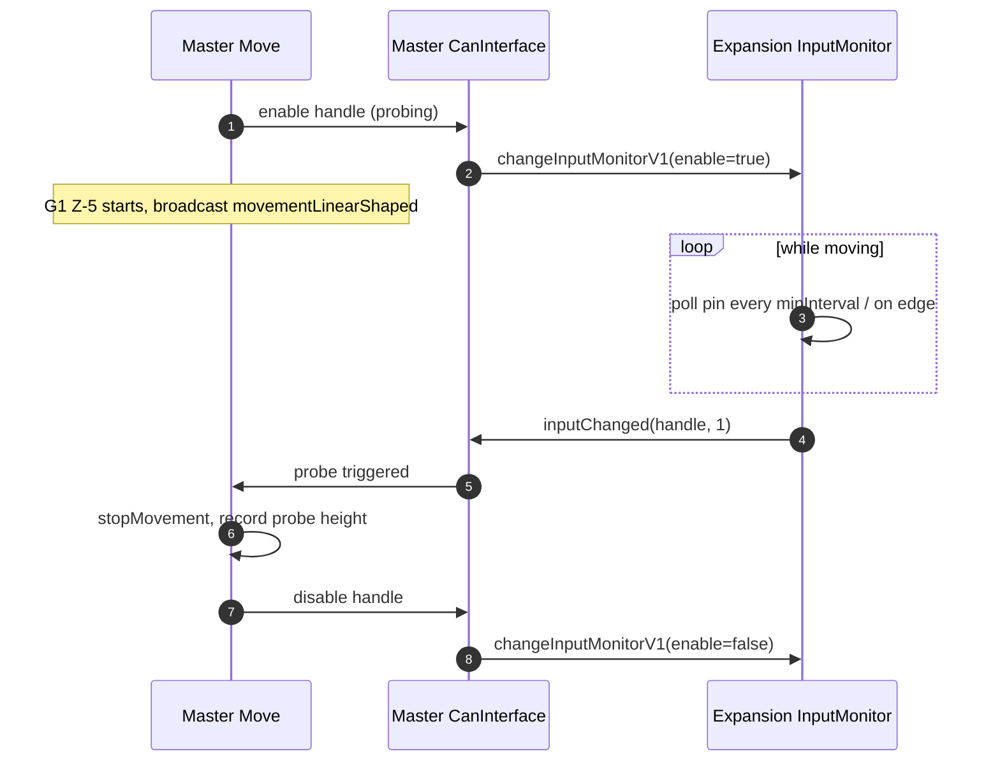

# Input Monitors

This document covers everything an expansion board does with **inputs** — endstops, Z-probes, filament monitors, GP-in pins, stall-detection from smart drivers — and how those inputs are exposed back to the master through the **remote handle** mechanism.

## 1. The remote handle abstraction

The master cannot see the silicon on this board directly. Instead it asks the board to allocate a *handle* against an input. The handle becomes the master's name for that input. From then on:

- The board pushes a `CanMessageInputChanged` whenever the input crosses a configured threshold or a configured polling interval expires.
- The master can read the current value at any time with `readInputsRequest`.
- The master can change the threshold / polling interval / enable state.



The same handle abstraction covers digital inputs (binary), analog inputs (above/below threshold), and "scanning" inputs like the LDC1612 inductive Z-probe.

## 2. The `RemoteInputHandle`

Defined in CANlib; on this side it is owned by [`InputMonitor`](../../src/InputMonitors/InputMonitor.cpp). A handle bundles:

- A pin reference.
- An enable flag.
- A threshold (for analog).
- A minimum polling / debounce interval.
- Optional touch-mode parameters (LDC1612, AS5601 magnetic filament monitor).

`InputMonitor` keeps a list of handles, scans them in `InputMonitor::CheckInputs` (called both periodically and on pin-change interrupt), and emits `inputChanged` messages when state changes.

## 3. Endstops and Z-probes

Endstops on tool / expansion boards reach the master through this exact mechanism. From RRF's perspective:

```cpp
// in master, after parsing M574 / M558 with a pin on a remote board:
CanInterface::CreateHandle(boardAddress, handleId, "io1.in", threshold, minInterval, &state, reply);
```

The master then watches that handle in its endstop / probe state machines. During homing or probing, the master enables the handle, watches for `inputChanged`, and aborts the running move when triggered.



## 4. Stall-detection endstops

TMC-driven smart drivers can be configured to flag a stall on the `DIAG` line. This becomes an internal pseudo-input handled by `InputMonitor` exactly like a wired endstop. `enableStallEndstop` is the message that arms it; the resulting `inputChanged` notifies the master.

## 5. Filament monitors

Filament monitors are conceptually a hybrid — they observe filament motion correlated against extruder steps and report errors back. There are several variants:

| Type | Hardware | Files |
|---|---|---|
| Pulsed (e.g. BTT SFS) | quadrature pulses / single pulse | [`PulsedFilamentMonitor`](../../src/FilamentMonitors/PulsedFilamentMonitor.cpp) |
| Rotating-magnet | hall sensor on a ratchet | [`RotatingMagnetFilamentMonitor`](../../src/FilamentMonitors/RotatingMagnetFilamentMonitor.cpp) |
| Laser optical | reflected-light sensor | [`LaserFilamentMonitor`](../../src/FilamentMonitors/LaserFilamentMonitor.cpp) |
| AS5601 magnetic ring (MFM) | encoder IC over I²C | [`MFMHandler`](../../src/CommandProcessing/MFMHandler.cpp) + [`MagneticFilamentMonitor`] |

Each one is created by `createFilamentMonitor`, configured by `configureFilamentMonitor`, and emits its events as `filamentMonitorChanged` (or via an InputMonitor handle for simple pulsed types). The master correlates the data with extruder commanded position to detect runout / slip.

## 6. Onboard sensor coordinators

Some boards have additional onboard sensors that the master driver needs to control:

- **`AccelerometerHandler`** ([CommandProcessing/AccelerometerHandler.cpp](../../src/CommandProcessing/AccelerometerHandler.cpp)) — LIS3DH on tool boards. `M956` triggers a sample burst; samples are streamed back as `accelerometerData`.
- **`ScanningSensorHandler`** ([CommandProcessing/ScanningSensorHandler.cpp](../../src/CommandProcessing/ScanningSensorHandler.cpp)) — LDC1612 inductive sensor used as scanning Z-probe. Configured by `M558` / `M655`.
- **`MFMHandler`** — AS5601 magnetic filament monitor.

These are not strictly "inputs" but follow the same pattern: master sends a setup message, the board collects data, and streams events back over CAN.

## 7. Where this connects to the rest of the system

- The handle lifecycle is initiated by the master; see [RepRapFirmware/docs/devel/CAN_BUS.md#remote-handles](https://github.com/Duet3D/RepRapFirmware/blob/3.7-docker/docs/devel/CAN_BUS.md#remote-handles).
- The `inputChanged` events feed into RRF's `Endstops`, `ZProbe`, `FilamentMonitor`, and `M581` trigger machinery.
- Object Model entries for any of the above show up under the appropriate root key (`sensors.endstops`, `sensors.probes`, `sensors.filamentMonitors`) and are populated *by the master* from data this firmware streams. This board has no Object Model.
