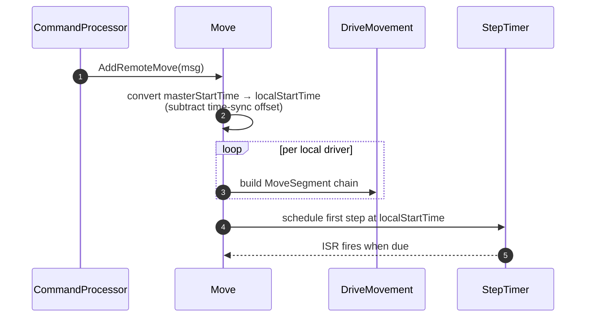
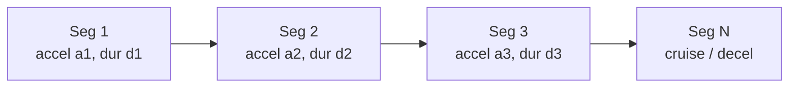
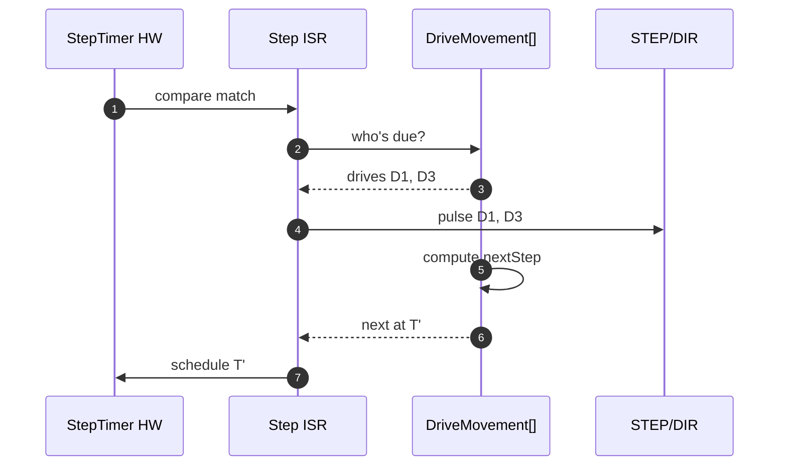
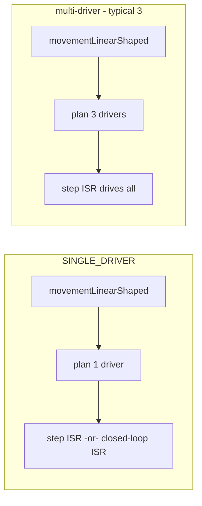

# Motion (slave-side)

This document describes how a Duet3Expansion board executes the motion the main board has assigned to it.

## 1. Where motion happens

```mermaid
flowchart LR
    Bus[CAN-FD bus<br/>movementLinearShaped] --> Rcv[CanInterface RX]
    Rcv --> CMQ[CanMessageQueue]
    CMQ --> CSpin[CommandProcessor::Spin]
    CSpin --> AddRemote[Move::AddRemoteMove]
    AddRemote --> SegPlan[Plan MoveSegment chains<br/>per local drive]
    SegPlan --> DM[DriveMovement records]
    DM --> Step[Step ISR<br/>StepTimer]
    Step --> Drv[STEP / DIR pins<br/>or TMC silent step]
```

In contrast to the main board, this firmware **does not plan** moves. The main board has already done jerk / acceleration / look-ahead / kinematics / input-shaping. What arrives over the wire is a fully shaped per-drive plan.

## 2. The wire format — `movementLinearShaped`

`CanMessageMovementLinearShaped` (in CANlib) packs:

- A start time, expressed in **master step clocks**.
- A duration.
- For each driver on this board:
  - Step count (signed).
  - Initial speed and acceleration profile coefficients.
  - Direction.
  - Optional input-shaped sub-segment chain.

A typical move fits in one CAN-FD frame (≤64 bytes). Highly shaped moves may span a couple of fragments.

## 3. Receiving a move

The conversion `localStartTime = masterStartTime − offset` is what makes the move land at the same wall-clock instant on every board. See [`CanInterface::CheckBrs`](../../src/CAN/CanInterface.cpp) and the time-sync section of [CAN_PROTOCOL.md](CAN_PROTOCOL.md#time-synchronisation).

## 4. The MoveSegment chain

Each driver gets a chain of `MoveSegment` records describing piecewise-linear acceleration:

`DriveMovement` ([src/Movement/DriveMovement.cpp](../../src/Movement/DriveMovement.cpp)) keeps a cursor through this chain — `nextStepTime` is calculated from the current segment's polynomial. When the cursor reaches the end of the current segment, it advances to the next.

This data structure is identical to RRF's — the same `MoveSegment` and `DriveMovement` types live on both sides because they are part of the shared math, only the *source* of segments differs (planner vs CAN).

## 5. The step ISR

[`StepTimer`](../../src/Movement/StepTimer.cpp) drives the same algorithm as on the main board:

1. ISR fires at the next-due step time.
2. For each drive that is due now:
   - Update DIR pin if changed.
   - Pulse STEP.
   - Ask DriveMovement for the next step time.
3. Schedule the timer for the new minimum across all drives.

The ISR runs at NVIC priority 5 (or local equivalent). It is the most performance-sensitive code in the firmware — no floats, no memory allocation, no FreeRTOS calls.

## 6. Stopping and reverting

Two ways a move can end early:

- **`stopMovement`** — master broadcasts after, e.g., probe trigger / emergency stop. Each board flushes its queue, parking drives at their current position. The master then takes over with a `revertPosition` if the position needs adjusting.
- **Local stall / endstop** — input monitor fires; the firmware aborts the in-flight move locally and pushes a `inputChanged` event so the master can react.

## 7. Single-driver vs multi-driver builds

`SINGLE_DRIVER` boards (e.g. TOOL1LC, 1HCL) have an optimised path that elides per-driver loops and unlocks the closed-loop variant.

## 8. Input shaping

Input shaping is applied *by the master* before the move is sent. The shaped sub-segment chain arrives in the `movementLinearShaped` payload; this firmware just plays it back. So the input-shaping mode in `M593` is a property of the printer as a whole — local drivers do not need to be told independently.

## 9. Pressure advance

For extruders, `setPressureAdvanceV1`/`V2` is sent to the board so that **the extruder's** segments include the appropriate advance. The math is the same as on the main board — see [`ExtruderShaper`](../../src/Movement/ExtruderShaper.cpp) — but applied to local drives only. This means extruder drivers can be on tool boards (where pressure advance is computed locally on top of the master's shaped move) and still produce smooth filament motion.

## 10. Closed-loop drivers

When `SUPPORT_CLOSED_LOOP` and a driver is configured for closed loop (`M569 P… D4`), the open-loop step ISR is replaced by a high-rate current loop in a dedicated task. Inputs are still `MoveSegment` chains; the loop tracks the *commanded* position derived from the chain and adjusts coil currents to make the rotor follow it. See [CLOSED_LOOP.md](CLOSED_LOOP.md).

## 11. Diagnostics

`M122 B<addr>` returns Move-related counters: how many segments executed, how many step-timer underruns occurred, average loop time, current queue depth, and the time-sync offset. These come from `Move::Diagnostics` and `StepTimer::Diagnostics`.

## 12. Where this connects to the rest of the system

- The matching master-side picture (look-ahead, DDA, kinematics, where the shaped move is built) is in [RepRapFirmware/docs/devel/MOTION_PIPELINE.md](https://github.com/Duet3D/RepRapFirmware/blob/3.7-docker/docs/devel/MOTION_PIPELINE.md).
- The wire format and time-sync mechanism are in [CAN_PROTOCOL.md](CAN_PROTOCOL.md).
- For the closed-loop variant of the step path, see [CLOSED_LOOP.md](CLOSED_LOOP.md).
